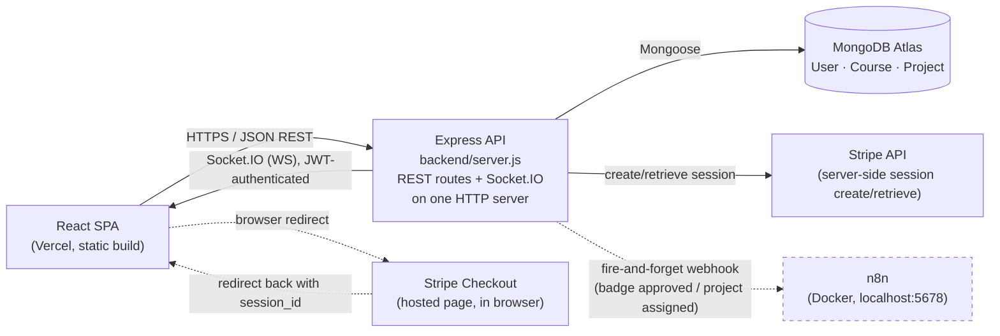
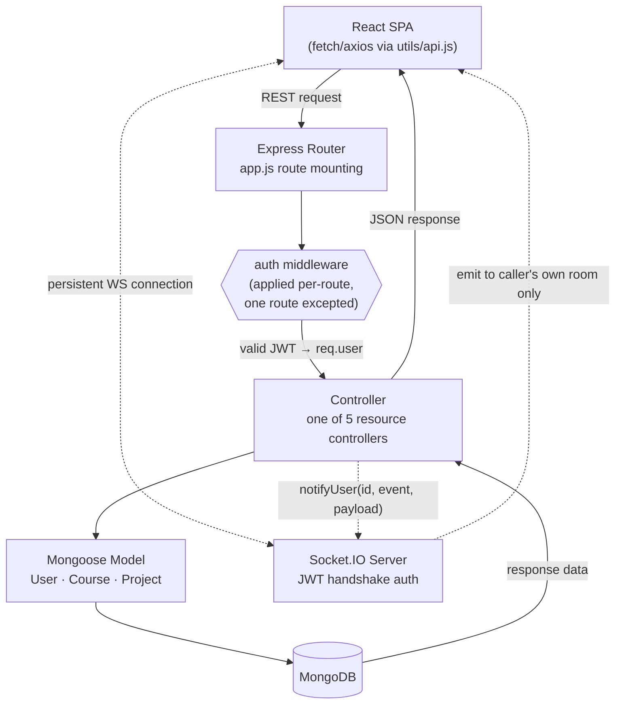
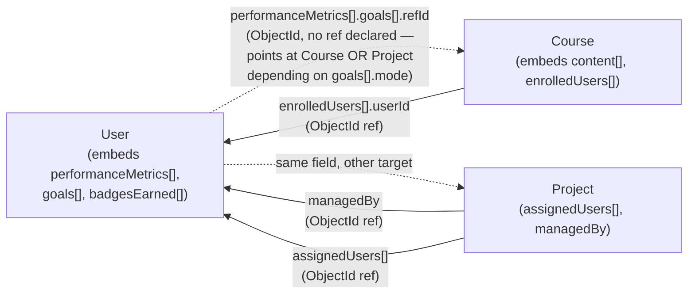
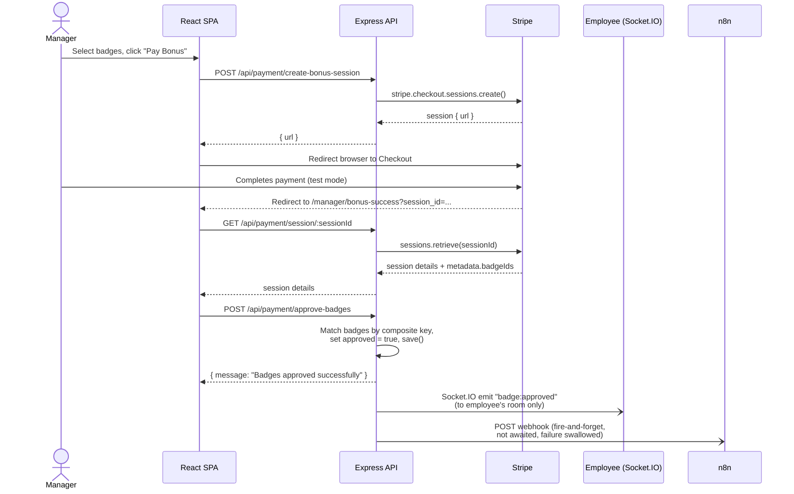

# CompanyGrow — Software Architecture Document

**Version 1.0 — July 2026**
Source: Direct analysis of the CompanyGrow codebase (`backend/`, `frontend/`, `.github/workflows/`, environment configuration, and deployed infrastructure).

---

## Table of Contents

1. [Introduction](#1-introduction)
2. [System Overview](#2-system-overview)
3. [Technology Architecture](#3-technology-architecture)
4. [High-Level Architecture](#4-high-level-architecture)
5. [Frontend Architecture](#5-frontend-architecture)
6. [Backend Architecture](#6-backend-architecture)
7. [Database Architecture](#7-database-architecture)
8. [API Architecture](#8-api-architecture)
9. [Authentication & Security](#9-authentication--security)
10. [Request & Data Flow](#10-request--data-flow)
11. [External Integrations](#11-external-integrations)
12. [Architectural Strengths](#12-architectural-strengths)
13. [Architectural Limitations](#13-architectural-limitations)

---

## 1. Introduction

### 1.1 Purpose of This Document

This Software Architecture Document (SAD) describes how CompanyGrow is designed and how its components interact. It is produced from direct inspection of the running codebase — every claim below is verifiable against a specific file, route, or configuration value in the repository. Where a detail is not present in the codebase (a named architectural pattern, a formal diagram, a scaling strategy), this document says so explicitly rather than inferring one.

### 1.2 Scope

Covered: overall system architecture and component organization; frontend and backend architecture; database architecture; API architecture; authentication and security; request/data flow; external service integrations; and a candid assessment of architectural strengths and limitations.

Out of scope: a full endpoint-by-endpoint reference (see `docs/TECHNICAL_DOCUMENTATION.md`), and UI-level feature walkthroughs.

### 1.3 Intended Audience

- Developers onboarding onto the codebase who need the shape of the system before making changes.
- Technical reviewers assessing architectural maturity and design trade-offs.
- Recruiters and interviewers evaluating engineering scope.
- Future maintainers prioritizing the remediation items in Section 13.

---

## 2. System Overview

### 2.1 Application Summary

CompanyGrow is a MERN-stack (MongoDB, Express, React, Node.js) web platform connecting three user roles — **employee**, **manager**, and **admin** — around training (courses), project allocation, performance tracking, and badge-based bonus payouts. At a system level it is composed of a single-page React frontend, a single Express/Node.js API that also hosts a Socket.IO server on the same HTTP server instance, a MongoDB document store accessed through Mongoose, and three external service integrations: Stripe (bonus payments), n8n (workflow automation via outbound webhooks), and — indirectly, via the deployment platforms themselves — Vercel and Render.

### 2.2 Architectural Style

The codebase does not name an architectural style anywhere in source. Structurally, the backend is a single Express application organized into layers — `routes/`, `controllers/`, `models/`, `middleware/` — which is consistent with a **modular monolith**. Unlike some comparable systems, there is no second standalone service or microservice split anywhere in the repository: the entire backend is one Node.js process (`server.js`), and Socket.IO is attached to that same HTTP server rather than run separately. This is a simpler topology than a multi-service system, with correspondingly fewer moving parts to deploy and reason about.

### 2.3 Major System Components

| Component | Description |
|---|---|
| React SPA | Single-page frontend (Create React App / `react-scripts`), organized by user role, communicating with the backend over REST and a JWT-authenticated Socket.IO connection. |
| Express API | The single backend process (`backend/server.js`); hosts all REST routes and the Socket.IO server on one HTTP server. |
| MongoDB | Document database accessed via Mongoose; the sole persistence layer, three collections. |
| Stripe | External payment gateway (test mode), used for bonus-payout Checkout sessions. |
| n8n | Self-hosted (Docker) workflow-automation tool, receiving fire-and-forget webhook calls from the backend on two specific events. |

### 2.4 General Application Flow

The React SPA issues REST calls to the Express API for the large majority of reads and writes, and maintains a Socket.IO connection for real-time notifications only (badge approvals, project assignments/completions, course completions — there is no chat or presence feature). The Express API is the only component that talks to MongoDB. Separately, the browser loads Stripe's Checkout UI (a full-page redirect, not an embedded widget) for the bonus-payment step, and the backend independently calls out to an n8n webhook URL as a side effect of two specific controller actions. There is no API gateway or reverse proxy documented or configured anywhere in front of the backend — in production, the Vercel-hosted frontend calls the Render-hosted backend's public URL directly.

---

## 3. Technology Architecture

| Technology | Purpose | Role & Interaction |
|---|---|---|
| React 19 | Frontend UI library | Renders the SPA; all styling is inline `style={}` objects, not CSS classes or a component library. |
| React Router 7 | Client-side routing | Two top-level routes (`/`, `/dashboard`) plus two Stripe-redirect routes; role-based view switching happens *inside* `/dashboard`, not via the URL (see §5.2). |
| Chart.js / react-chartjs-2 | Data visualization | Renders performance/badge analytics charts in the manager review and employee performance views. |
| jsPDF + html2canvas | Client-side PDF export | Exports performance visualizations as PDF, used in `employee/perf.js` and `manager/review.js`. |
| Socket.IO (client) | Real-time client library | Connects with a JWT (`socket.io-client`, `services/socket.js`), listens for 4 named notification events. |
| Node.js | Backend runtime | Runs the single Express API process. |
| Express 5 | Backend web framework | Implements the REST API layer (`app.js`); shares its HTTP server instance with Socket.IO (`server.js`). |
| Mongoose 8 | MongoDB ODM | Defines three schemas (User, Course, Project) and mediates all database access. |
| Socket.IO (server) | Real-time server library | Attached to the same `http.Server` as Express; **authenticates every connection with the same JWT used by the REST API** (see §9.3) — unlike many comparable real-time layers, this one is not open. |
| JWT (jsonwebtoken) | Auth token issuance/verification | Issues a 24-hour bearer token on login/signup; the same secret and verification logic is reused for the Socket.IO handshake. |
| bcryptjs | Password hashing | Hashes passwords with a cost factor of 10 before persistence, in `auth.controller.js` and `user.controller.js`. |
| MongoDB | Document database | Sole persistence layer; three collections, no transactions. |
| Stripe | Payment gateway | Server-side Checkout Session creation and retrieval (`payment.controller.js`); client-side redirect via `@stripe/stripe-js`. |
| n8n | Workflow automation | Receives two webhook event types from the backend; not part of the request/response cycle — calls are fire-and-forget. |

**Note:** `bcrypt` (the native-binding package, distinct from `bcryptjs`) and `react-scripts` are both listed in `backend/package.json` but neither is ever imported by backend code — see §13.1 for the full dead-dependency inventory.

---

## 4. High-Level Architecture

### 4.1 Topology

*Figure 1 — High-level system topology.* Solid arrows are backend-mediated; the Stripe Checkout redirect is a full browser navigation initiated by the backend's response, not a direct client-to-Stripe API call. The n8n call is entirely one-directional, asynchronous, and (in the current production deployment) unreachable — dashed to indicate it is best-effort, not a hard dependency.

### 4.2 Component Interaction Diagram

*Figure 2 — Component interaction diagram.* The layered REST request path (solid) alongside the parallel, JWT-authenticated Socket.IO path (dashed) that a controller uses to push a real-time notification back to the same user who triggered the underlying action — never a different user, since the Socket.IO room is derived from the verified token, not from client input (§9.3).

### 4.3 Process Topology

Unlike systems that split payment or automation logic into a separate microservice, CompanyGrow runs as exactly **two** processes in local development, and two in production:

| Process | Entry Point | Port (local) | Role |
|---|---|---|---|
| Backend API | `backend/server.js` | `4000` (via `PORT` env var) | Express REST API + Socket.IO server, single process |
| Frontend dev server | `frontend` (CRA) | `3000` | React SPA (development only — production serves a static build from Vercel) |

There is no separate payment microservice, no worker process, and no API gateway. n8n runs as a third, *independent* process (a Docker container) that the backend talks to over HTTP — it is not part of the application's own process topology, and the application functions correctly (Stripe, auth, project/course flows) if n8n is not running at all.

### 4.4 Deployment Topology

This is one of the few sections in this document describing a **confirmed, live** deployment rather than only local development — CompanyGrow is actually deployed, which is not a given for a project at this stage:

- **Frontend**: Vercel, root directory `frontend`, Create React App preset, static build served from Vercel's CDN — live at [company-grow-rho.vercel.app](https://company-grow-rho.vercel.app).
- **Backend**: Render, root directory `backend`, `node server.js`, connected to a MongoDB Atlas cluster — live at [companygrow-backend-meud.onrender.com](https://companygrow-backend-meud.onrender.com).
- **n8n**: not deployed publicly — runs only in a local Docker container. The production backend's `N8N_*_WEBHOOK_URL` environment variables point at `localhost:5678`, which is unreachable from Render's servers. In production, the fire-and-forget webhook calls simply fail silently (caught, logged, non-blocking) — see §13.1.

---

## 5. Frontend Architecture

### 5.1 Overall Structure

The frontend is a Create React App (`react-scripts`) single-page application. Source is organized under `frontend/src` into `pages/` (the entire application UI, split into `admin/`, `manager/`, `employee/`, and `dashboard/` folders), `components/` (currently one file — `NotificationBell.js`), `services/` (Socket.IO client wrapper, plus one unused API wrapper — see §5.6), and `utils/` (the actively-used fetch wrapper). `App.js` defines the route table; `index.js` is the React entry point, wrapped in `React.StrictMode`.

### 5.2 Routing

Routing is minimal and centralized in `App.js`, using React Router 7:

| Path | Component |
|---|---|
| `/` | `Login` (handles both login and signup in one component) |
| `/dashboard` | `DashboardRouter` |
| `/manager/bonus-success` | `BonusSuccess` (Stripe Checkout success redirect target) |
| `/manager/payment-failed` | `PaymentFailed` (Stripe Checkout cancel redirect target) |

Unlike a role-scoped URL pattern (e.g. `/manager/:id/page`), **role-based view selection happens entirely inside `DashboardRouter`**, which reads `localStorage.getItem('role')` and renders one of `EmployeeDashboard`, `ManagerDashboard`, or `AdminDashboard` — all mounted at the same `/dashboard` URL. There is no client-side route guard equivalent to a `ProtectedRoute` wrapper; a signed-out user visiting `/dashboard` directly gets `EmployeeDashboard` regardless — `DashboardRouter`'s role lookup (`localStorage.getItem('role') || 'employee'`) falls back to the literal string `'employee'` when nothing is stored, which then matches the switch statement's `'employee'` case (its actual `default` case, an "Unauthorized access" message, is effectively unreachable through this lookup). Within each dashboard, "tabs" (Catalog, Develop, Performance, Profile, etc.) are plain component-swap state (`useState('dashboard')`), not distinct URLs — a browser refresh always returns to that dashboard's default tab.

### 5.3 State Management

There is no Redux, Zustand, Context API, or other shared state layer. Authentication state (`token`, `role`, `name`, `id`) is stored directly in `localStorage` by `login.js` on successful login, and read directly from `localStorage` by whichever component needs it (`utils/api.js` for the bearer token, `dashboardRouter.js` for the role, `services/socket.js` for the socket auth token, and individual pages for the user id). There is no single "current user" object passed through the component tree.

### 5.4 Components

`components/NotificationBell.js` is the one shared UI component in the codebase: a bell icon with an unread-count badge and a dropdown of recent notifications, driven by the Socket.IO connection (see §10.2). It is mounted independently in all three dashboard shells (`employee/dashboard.js`, `manager/dashboard.js`, `admin/dashboard.js`) rather than in a single shared layout wrapper, since no such wrapper exists — each dashboard implements its own navbar markup independently, with near-identical (but separately maintained) inline style objects.

### 5.5 User Interface Organization

Each role has its own dashboard shell with an internal tab set:

| Role | Tabs |
|---|---|
| Employee | Catalog, Develop, Performance, Profile |
| Manager | Catalog, Manage, Review, Profile |
| Admin | Users, Courses, Projects |

The manager's **Review** tab is the entry point to badge approval and bonus payout (§10.4); the manager's **Manage** tab handles project assignment.

### 5.6 Communication with the Backend

Three coexisting HTTP patterns exist in the frontend, a documented architectural characteristic rather than an oversight of this document:

- **`utils/api.js`** — a `fetch`-based wrapper (`makeAuthenticatedRequest`) that injects the bearer token from `localStorage`, auto-clears storage and redirects to `/` on a `401`, and reads its base URL from `REACT_APP_API_URL`. This is the dominant pattern, imported by 18 of the ~23 page files.
- **`services/api.js`** — an `axios`-based wrapper exporting `registerUser`/`loginUser`, pointed at a hardcoded `http://localhost:4000`. **This file is never imported anywhere in the codebase** — it is dead code left over from an earlier implementation.
- **`login.js`** — calls `fetch` directly against `${REACT_APP_API_URL}/api/auth/login` and `/signup`, bypassing both wrappers above. This makes sense functionally (there is no bearer token to attach before login succeeds), but it also means `login.js` does not benefit from `utils/api.js`'s centralized 401-handling or error normalization.

Unlike a system where the API base URL is hardcoded across many files, **CompanyGrow's active communication paths are environment-driven** (`REACT_APP_API_URL`), which is what allows the same frontend build to run correctly against both `localhost:4000` (development) and the live Render backend (production) — see §12.

---

## 6. Backend Architecture

### 6.1 Overall Organization

The backend is a single Express 5 application organized into: `routes/` (one Express router file per resource), `controllers/` (business logic, one file per resource), `models/` (three Mongoose schemas), and `middleware/auth.js` (the only middleware in the codebase — JWT verification). There is no `services/`, `utils/`, or `config/` directory — connection setup lives directly in `server.js`, and there is no separate business-logic utility layer (scoring algorithms, formatters, etc.) anywhere in the backend.

### 6.2 Request Handling

A typical authenticated request flows: `server.js` (HTTP server) → `app.js` (Express app, route mounting) → route file (path match, `auth` middleware applied per-route) → controller function → Mongoose model → MongoDB → JSON response. Every mutating route in the API applies the `auth` middleware **except one** — `POST /api/project/completeProject/:id` — which is documented in §9.2 and §13.1 as a specific, isolated gap rather than a systemic pattern.

### 6.3 Business Logic Organization

Business logic is organized into five controllers, each scoped to a resource:

| Controller | Resource | Notable logic |
|---|---|---|
| `auth.controller.js` | Login / signup / logout | Issues a 24h JWT; signup always assigns `role: 'employee'` regardless of any role value in the request body — there is no self-service path to create a manager or admin account. |
| `user.controller.js` | User CRUD, profile, performance | `modifyProfile` explicitly strips `performanceMetrics` from any update payload to prevent a user from editing their own performance record through the profile-edit endpoint. |
| `course.controller.js` | Course CRUD, enrollment, module completion | Computes a "bi-month" performance period label (e.g. `Jan-Feb 2026`) from the current date; awards a badge and new skills to the user's profile when a course reaches 100% completion. |
| `project.controller.js` | Project CRUD, assignment, completion | `assignProjectToUser` and `deassignProjectFromUser` are internal helper functions (not routes) called from `addProject`, `modifyProject`, and `modifyUsers`; badge/skill awarding on `completeProject` mirrors the course-completion logic almost exactly, independently implemented rather than shared. |
| `payment.controller.js` | Badge approval, Stripe Checkout | `approveBadges` matches badges via a synthesized composite key (`period-type-title-dateEarned.toISOString()`) rather than a stored badge ID, since `badgesEarned` subdocuments are not given their own `_id` lookup path in the frontend flow. |

### 6.4 Middleware

Exactly one middleware module exists: `middleware/auth.js`, exporting a single `auth` function that reads the `Authorization: Bearer <token>` header, verifies it against `JWT_SECRET` (with a hardcoded fallback `'companygrow_secret_key'` if the env var is unset), and attaches the decoded payload to `req.user`. There is no role-based `authorize(...)` middleware anywhere — `auth` only confirms *that* a request is authenticated, not that the authenticated user's role is permitted to perform the specific action. Role checks, where they exist at all, happen only implicitly (the frontend simply doesn't render the UI for actions outside a role) rather than being enforced server-side.

### 6.5 Validation

Input validation is ad hoc and controller-specific; there is no shared validation library (no Joi, Zod, or express-validator) in the dependency list. Most controllers check only for the presence of required fields before querying the database (e.g. `addProject` checks `name`/`description`/`managerId`), relying on Mongoose's own schema-level constraints (`required`, `enum`, `min`) as the last line of defense for anything not explicitly checked.

### 6.6 Error Handling

There is no shared response-formatting utility or centralized error-handling middleware — every controller implements its own `try/catch`, returning an HTTP `500` on unhandled errors. The JSON error-body shape is **not uniform across the codebase**: `auth.controller.js` and `user.controller.js` return `{ message }`, while `course.controller.js`, `project.controller.js`, and `payment.controller.js` return `{ error }`. A frontend component written against one shape would silently fail to surface an error message from a controller using the other shape.

### 6.7 API Organization

All routes are defined in separate router files (`routes/*.route.js`), mounted in `app.js` under five base paths: `/api/auth`, `/api/user`, `/api/course`, `/api/project`, `/api/payment`. There is no inline-route pattern (unlike systems that mix router-file routes with routes defined directly in the entry file) — `app.js` mounts routers exclusively.

---

## 7. Database Architecture

### 7.1 Database Technology

CompanyGrow uses MongoDB as its sole persistence layer, accessed exclusively through Mongoose from the Express API. No other database, cache, or search technology is present anywhere in the codebase.

### 7.2 Data Organization

The schema is organized into **three** collections: `User`, `Course`, and `Project` — a notably smaller and flatter schema than a typical multi-entity platform. There is no separate collection for badges, notifications, or payment records; all of that data is embedded directly on the `User` document (see §7.4).

### 7.3 Relationships

Inter-collection relationships are implemented as genuine Mongoose `ObjectId` references: `Project.assignedUsers[]` and `Project.managedBy` reference `User`; `Course.enrolledUsers[].userId` references `User`; `performanceMetrics[].goals[].refId` on `User` references either a `Course` or a `Project` document, **without a Mongoose `ref` declaration** (the schema comment explicitly notes "No strict ref because it can point to either Course or Project") — meaning Mongoose cannot `populate()` this field automatically, and referential integrity across the two possible target collections is enforced only by application logic, not by the schema.

*Figure 3 — Collection relationship overview.* Solid arrows are true Mongoose `ObjectId` references, resolvable via `.populate()`. The dashed arrows are the one relationship in the schema that is **not** a typed reference — `goals[].refId` can point at either `Course` or `Project`, so Mongoose cannot `populate()` it, and nothing enforces which collection it actually points at beyond the application code that wrote it.

### 7.4 Storage Approach

The schema is heavily denormalized around the `User` document. `performanceMetrics` is an embedded array on `User`, and within each period, `badgesEarned` and `goals` are further embedded subdocuments — there is no separate `Badge` or `Goal` collection anywhere. This keeps a user's entire performance history co-located on a single document (simplifying reads for the employee performance view and manager review view) at the cost of the document growing unboundedly over an employee's tenure, since nothing in the schema caps or archives old `performanceMetrics` entries.

### 7.5 Persistence Strategy

No MongoDB transactions or multi-document ACID guarantees are used anywhere in the codebase. `completeProject` and `completeModule`, for example, update multiple `User` documents (all assigned/enrolled users) in a sequential loop with independent `.save()` calls per user — a failure partway through leaves some users updated and others not, with no rollback.

### 7.6 Indexing

Indexes are defined on all three collections in support of the application's actual query patterns: `User` on `{department}`, `{role}`, `{skills}`, `{isActive}`; `Course` on `{category}`, `{skillsGained}`; `Project` on `{status, priority}` and `{createdAt: -1}`.

### 7.7 Not Specified

- No formal entity-relationship diagram exists in the source.
- No database migration tooling exists; the `seeds/` scripts are one-shot population scripts, not a migration framework, and two of the three (`user.seed.js`, `course.seed.js`) destructively `deleteMany()` their target collection before reseeding.
- No documented backup, archival, or data-retention strategy for MongoDB — this is entirely delegated to the MongoDB Atlas hosting layer, outside the application's own code.
- No sharding, replication, or high-availability configuration is present in application code (any such configuration would live in the Atlas cluster settings, which are not part of this repository).

---

## 8. API Architecture

### 8.1 API Organization

The API is a REST-style JSON API. All endpoints are mounted under one of five base paths (see §6.7); there is no API versioning (no `/api/v1/` convention or equivalent). Response shape is **not** uniform — some controllers return `{ message, ...data }`, others `{ error, ... }`, described in §6.6.

### 8.2 Request Flow

A client request reaches Express, is matched against a mounted router's path, optionally passes through the single `auth` middleware if that specific route applies it, is handled by a controller function, and results in one or more Mongoose model calls against MongoDB.

### 8.3 Response Flow

Responses are constructed and returned directly by each controller; there is no centralized response-formatting or serialization layer, and no consistent envelope convention (see §6.6).

### 8.4 Authentication in the API Layer

Where applied, authentication is enforced via the single `auth` middleware, validating a JWT bearer token and attaching the decoded payload (`id`, `email`, `role`) to `req.user`. **Every route in the API applies this middleware except one** (`POST /api/project/completeProject/:id`) — this is a materially different (and stronger) posture than a system where authentication is applied inconsistently across many routes; here it is the default, with a single documented exception.

---

## 9. Authentication & Security

### 9.1 Authentication Mechanism

Authentication is stateless and JWT-based. On login or signup, `auth.controller.js` issues a token via `jwt.sign({ id, email, role }, SECRET, { expiresIn: '24h' })`. The frontend stores this token in `localStorage` (not an `httpOnly` cookie) and manually attaches it as an `Authorization: Bearer` header via `utils/api.js`. Passwords are hashed with `bcryptjs` (`bcrypt.hash(password, 10)`) before persistence; there is no pre-save Mongoose hook for this — hashing happens explicitly in the controller (`auth.controller.js` and `user.controller.js` each do this independently).

### 9.2 Authorization Model

There is no role-based authorization middleware — only the binary `auth` (authenticated / not authenticated) check described in §6.4. Role-appropriate behavior is enforced by the frontend choosing which UI to render, not by the backend refusing a request from an authenticated user of the wrong role. For example, nothing in `project.controller.js` stops an authenticated **employee**'s token from successfully calling `POST /api/project/addProject` — the only backend-side gate is a valid JWT, not a role check.

The one route with no authentication requirement at all is `POST /api/project/completeProject/:id`, which lets any caller — authenticated or not — mark a project complete, award badges, and grant new skills to every assigned user's profile.

### 9.3 Real-Time Channel Security

Unlike a real-time layer that trusts a client-supplied identifier, **CompanyGrow's Socket.IO server authenticates every connection**: `socket.js` runs an `io.use()` middleware on the handshake that requires a valid JWT (the same secret and same tokens issued by `auth.controller.js`), decodes it, and joins the socket to a private room named after the decoded `id` — never a client-supplied value. `notifyUser(userId, event, payload)` emits only to that user's own room. A client cannot subscribe to another user's notifications by supplying a different ID, because the room name is derived server-side from the verified token, not from anything the client sends after connecting.

### 9.4 Input Validation

As documented in §6.5, validation is ad hoc and controller-specific, backstopped by Mongoose schema constraints.

### 9.5 File Upload Security

Not applicable — there is no file upload functionality anywhere in the application. The `profileImage` field on the `User` model is a plain `String`; nothing in the codebase writes to it via an actual upload endpoint.

### 9.6 Payment Security

Stripe integration relies entirely on Stripe's own server-side SDK (`stripe.checkout.sessions.create` / `.retrieve()`) using the secret key; there is no webhook signature verification implemented (there is no Stripe webhook endpoint at all — payment confirmation is read back by the frontend polling `getSessionDetails` after redirect, not pushed via a Stripe webhook). This means the "source of truth" for a completed payment is a client-initiated `GET` request to Stripe's session-retrieval API, not a server-to-server webhook — functionally correct for this app's flow, but a materially different (and less robust) integration pattern than a webhook-verified one.

### 9.7 Environment Variable Configuration

`.env` is excluded from git via `.gitignore` in this repository; `.env.example` files exist at both `backend/` and `frontend/` documenting every variable.

| Variable | Scope | Purpose |
|---|---|---|
| `PORT` | Backend | Port the Express server listens on |
| `MONGO_URI` | Backend | MongoDB connection string |
| `JWT_SECRET` | Backend | Signs/verifies JWTs — has a hardcoded fallback (`companygrow_secret_key`) if unset |
| `STRIPE_SECRET_KEY` | Backend | Server-side Stripe key |
| `CLIENT_URL` | Backend | Stripe redirect URLs **and** Socket.IO CORS origin |
| `N8N_BADGE_APPROVED_WEBHOOK_URL` | Backend | Optional n8n webhook target |
| `N8N_PROJECT_ASSIGNED_WEBHOOK_URL` | Backend | Optional n8n webhook target |
| `REACT_APP_STRIPE_PUBLISHABLE_KEY` | Frontend | Client-side Stripe key (has a hardcoded fallback test key in `review.js` if unset) |
| `REACT_APP_API_URL` | Frontend | Base URL of the backend API + Socket.IO server |

**Note on CORS asymmetry**: `app.use(cors())` in `app.js` is called with no options, meaning the REST API accepts requests from **any** origin. The Socket.IO server, by contrast, explicitly restricts its `cors.origin` to the single value of `CLIENT_URL`. This is an inconsistency worth flagging: the more sensitive of the two channels in terms of blast radius (REST, which can mutate data) is the more permissive one; the less mutable channel (Socket.IO, notification-only, read-only from the client's perspective) is the one with an origin restriction.

---

## 10. Request & Data Flow

### 10.1 Synchronous REST Flow

The majority of reads and writes — courses, projects, user profiles, performance data — flow through Express routes, into controllers, into Mongoose models, and to MongoDB, returning a JSON response (shape varies per controller, see §6.6).

### 10.2 Real-Time Socket.IO Flow

Four named events are pushed from the backend to a specific user's private Socket.IO room:

| Event | Fired from | Trigger |
|---|---|---|
| `badge:approved` | `payment.controller.js` | A manager approves ≥1 badge via `POST /api/payment/approve-badges` |
| `project:assigned` | `project.controller.js` | A user is newly added to `assignedUsers` on a project |
| `project:completed` | `project.controller.js` | `POST /api/project/completeProject/:id` — fired once per assigned user |
| `course:completed` | `course.controller.js` | A user's course module completion pushes progress to 100% |

The frontend's `NotificationBell.js` listens for all four, appends to an in-memory (not persisted) notification list capped at 20 items, and shows an unread-count badge. Notifications are **not** persisted anywhere — a page refresh clears the list; there is no `Notification` collection in MongoDB.

### 10.3 Outbound Automation Flow (n8n)

Two of the four events above **also** trigger a second, independent side effect: a fire-and-forget `fetch()` POST to an n8n webhook URL, read from an environment variable. This is not a generic "every event fans out to n8n" design — only `badge:approved` (in `payment.controller.js`) and `project:assigned` (in `project.controller.js`) have this second side effect; `project:completed` and `course:completed` do not. The webhook call is deliberately not awaited before the HTTP response is sent, and any failure (network error, non-2xx response — the code does not check `response.ok`) is caught and logged, never surfaced to the end user or allowed to fail the underlying request.

### 10.4 Example Flow: Badge Approval → Bonus Payout

As a representative example of how several of this document's earlier sections combine in practice: a manager reviews an employee's earned badges on the **Review** tab and selects some to convert into a bonus. This does **not** call `approve-badges` directly — it first creates a Stripe Checkout session, and only *after* that payment succeeds does badge approval happen as a side effect.

*Figure 4 — Badge approval / bonus payout sequence.* Note the two `-)` async arrows at the bottom fire **after** the HTTP response to the frontend has already been sent — the Socket.IO notification and the n8n webhook call are both non-blocking side effects, not steps the manager's browser waits on.

**In the current implementation, there is no way to mark a badge "approved" without also completing a Stripe payment** — badge approval is a side effect of successful payment, not an independent manager action, even though the two are conceptually separable. (A React `useRef` guard in `bonus-success.js` specifically prevents the `approve-badges` call from firing twice under React 18 `StrictMode`'s development-mode double-effect invocation — see §12.)

---

## 11. External Integrations

| Integration | Purpose | Interaction with the System | Notes |
|---|---|---|---|
| Stripe | Bonus payment processing | Server-side Checkout Session creation/retrieval; client redirects to Stripe's hosted page via `@stripe/stripe-js` | Test mode in the current deployment; no webhook signature verification (see §9.6) |
| n8n | Workflow automation | Two backend controllers POST a JSON payload to an n8n webhook URL on specific events | Self-hosted via Docker; not reachable from the production backend (see §4.4, §13.1) |
| Socket.IO | Real-time notifications | Backend emits to per-user rooms; frontend listens via `socket.io-client` | JWT-authenticated (§9.3) — a materially stronger posture than an unauthenticated real-time layer |
| MongoDB Atlas | Managed database hosting | Connection string via `MONGO_URI` | Outside application code; backup/scaling handled at the Atlas layer |
| Vercel | Frontend hosting | Static build deployment from `frontend/`, `CI=false` required | Live |
| Render | Backend hosting | `node server.js` process deployment from `backend/` | Live; free tier sleeps after inactivity |
| GitHub Actions | CI | Runs backend tests + frontend build on every push/PR to `main` | See `.github/workflows/ci.yml` |

---

## 12. Architectural Strengths

Based on direct inspection of the codebase and its deployed state:

- **Actually deployed, not just deployable in theory.** Unlike a system whose frontend hardcodes a `localhost` backend address, CompanyGrow's active communication paths (`utils/api.js`, `login.js`, `services/socket.js`) all read their target from `REACT_APP_API_URL`, and the backend's Socket.IO CORS reads from `CLIENT_URL` — which is exactly what allowed the same codebase to run correctly against both local development and the live Vercel/Render deployment without any code changes, only environment configuration.
- **Authenticated real-time channel.** The Socket.IO server verifies a JWT on every connection handshake and derives the notification "room" from the verified token, not from anything the client asserts — closing a class of vulnerability (impersonating another user's notification stream) that is common in real-time layers bolted onto an otherwise-authenticated REST API.
- **Near-total, consistent REST authorization coverage.** Every mutating route in the API requires a valid JWT except one, narrowly scoped and specifically identified (§9.2) — rather than authentication being applied unevenly across many routes, it is the default here with a single, fixable exception.
- **A real automated test suite, exercised in CI.** 17 Jest/Supertest tests across 5 suites run against an in-memory MongoDB (`mongodb-memory-server`) — no external database or `.env` file is required to run them, which is also what makes them viable in GitHub Actions without provisioning test infrastructure.
- **Externally verified, not just internally believed, integrations.** The Stripe bonus-payment flow, the n8n badge-approval and project-assignment webhooks, and the Socket.IO notification delivery were each confirmed working end-to-end against the real, running services during development (not only unit-tested in isolation) — including catching and fixing a live production CORS misconfiguration and a duplicate-notification bug before they were considered done.
- **Graceful degradation on the automation path.** The n8n webhook calls are deliberately non-blocking and failure-tolerant: if n8n is unreachable (as is currently the case in the production deployment — see §13.1), badge approval and project assignment still succeed correctly; only the optional automation side effect is silently skipped.

---

## 13. Architectural Limitations

### 13.1 Documented System Limitations

- **No role-based authorization middleware.** The backend has exactly one authorization primitive — "is this request authenticated at all" — with no equivalent of an `authorize('admin')` check anywhere. An authenticated employee's token can successfully call admin/manager-only endpoints (e.g. `addProject`, `addCourse`); the frontend simply doesn't expose UI for it.
- **One fully unauthenticated mutating route.** `POST /api/project/completeProject/:id` has no `auth` middleware at all — any caller who knows or guesses a project ID can mark it complete and award badges/skills to every assigned user, with no token required.
- **Inconsistent error response shape.** `auth.controller.js`/`user.controller.js` return `{ message }` on error; `course.controller.js`/`project.controller.js`/`payment.controller.js` return `{ error }`. A frontend error handler written against one shape will not surface the other.
- **n8n automation is not reachable in production.** Both `N8N_*_WEBHOOK_URL` values point at `localhost:5678`; Render's servers cannot reach a container running on a developer's laptop. In the live deployment, both webhook calls fail silently every time (by design — they're fire-and-forget) — the automation was built, verified, and works, but only against a local backend instance.
- **CORS asymmetry.** The REST API accepts requests from any origin (`cors()` with no options); Socket.IO restricts to a single configured origin. The more mutation-capable surface is the less restricted one.
- **No Stripe webhook signature verification.** Payment confirmation is read back via a client-initiated `GET` request after redirect, not pushed via a signed Stripe webhook — functionally sufficient for the current flow, but not the more robust integration pattern Stripe recommends for production payment systems.
- **`assignProjectToUser`/`deassignProjectFromUser` badge/skill-award logic is duplicated, not shared, between `project.controller.js` and `course.controller.js`.** The two implementations are independently maintained and could silently drift.
- **A confirmed frontend routing bug**: `manager/payment-failed.js` calls `GET /api/bonus/session/:sessionId` — no `/api/bonus` base path is mounted anywhere in `app.js` (the real route is `/api/payment/session/:sessionId`). Every failed-payment page load therefore fails to fetch its own session details and falls back to a generic error state.
- **Dead code and unused dependencies**: `frontend/src/services/api.js` (an axios-based API wrapper) is never imported anywhere. `backend/package.json` lists both `bcrypt` (never `require()`'d — only `bcryptjs` is used) and `react-scripts` (a frontend build tool, meaningless in a Node API's dependency list) as dependencies. `frontend/package.json` lists three `@tailwindcss/*` packages and `bcryptjs`, none of which are imported or used anywhere in frontend source (all styling is inline `style={}` objects; there is no client-side use case for a password-hashing library).
- **No MongoDB transactions.** Multi-document updates (e.g. awarding a badge to every assigned user on project completion) are sequential, independent `.save()` calls with no rollback on partial failure.
- **Notifications are not persisted.** The `Notification`-equivalent data delivered over Socket.IO exists only in the connected client's in-memory React state; a page refresh discards it, and there is no way to view notification history from a prior session.

### 13.2 Missing Architectural Documentation

The following are not specified anywhere in the codebase, and this document does not assume or infer values for them:

- No formally named architectural style (the "modular monolith" characterization in §2.2 is this document's structural inference from the code layout, not a stated decision).
- No infrastructure-as-code, container configuration (`Dockerfile`, `docker-compose.yml` for the app itself — Docker is used only to run n8n locally, not the application), or formal deployment manifest for either Vercel or Render beyond their own dashboard configuration.
- No API versioning strategy.
- No rate-limiting, throttling, or abuse-prevention mechanism at the API layer.
- No structured logging, error tracking, metrics, or tracing — the only logging present is ad hoc `console.log`/`console.error` calls scattered through controllers.
- No horizontal-scaling or load-balancing strategy; the backend is a single Node.js process with no clustering.
- No frontend automated test suite beyond the unmodified Create React App boilerplate (`App.test.js`, which asserts on a "learn react" link that no longer exists in the customized `App.js` — this test would fail if run, though it is not currently executed by CI).
- No formal entity-relationship diagram; §7 describes the three-collection schema in prose and a relationship list rather than reproducing one here.
